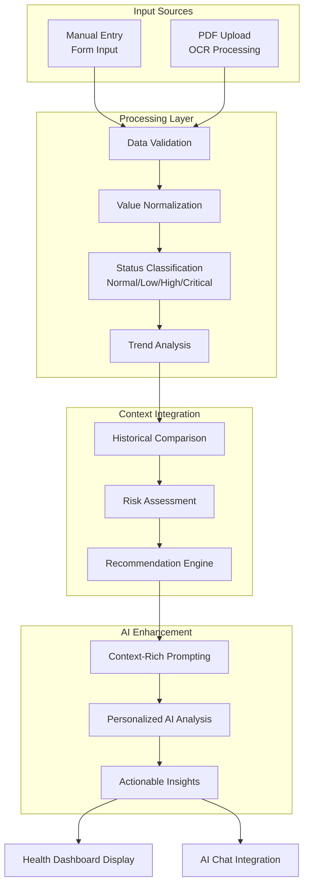

# Health360 System Architecture

## Overview

Health360 is an AI-powered personalized health platform that combines customer health data with Retrieval-Augmented Generation (RAG) to provide tailored health insights and recommendations. The system leverages OpenAI's GPT-4o-mini for intelligent analysis while maintaining a robust fallback system for reliability.

## High-Level Architecture


## Personalization Flow with RAG


## Data Integration Architecture


## RAG Context Building Process


## Lab Results Processing Pipeline



## Product Recommendation RAG Flow


## AI Chat System Architecture


## Key Features of the RAG Implementation

### 1. Multi-Source Data Integration
- **User Demographics**: Age, health goals, lifestyle preferences
- **Lab Results**: Testosterone levels, cholesterol, vitamin D, etc.
- **Interaction History**: Previous questions, concerns, and responses
- **Health Assessments**: Energy levels, sleep quality, stress indicators

### 2. Context-Aware Prompt Engineering
```typescript
// Example context building from the codebase
const buildHealthContext = (user: User, labResults: LabEntry[], chatHistory: ChatMessage[]) => {
  const labSummary = buildLabSummary(labResults);
  const conversationHistory = chatHistory.slice(-6);
  
  return `
    User Context:
    - Age: ${user.age}
    - Health Goals: ${user.healthGoals}
    - Recent Lab Results: ${labSummary}
    - Conversation History: ${conversationHistory}
  `;
};
```

### 3. Intelligent Fallback System
- Rule-based responses when OpenAI is unavailable
- Context-aware fallback using user data
- Maintains personalization even without AI

### 4. Continuous Learning Loop
- User interactions are stored for future context
- Response effectiveness tracking
- Personalization improves over time

## Technology Stack

### Frontend
- **React 18** with TypeScript
- **Tailwind CSS** for styling
- **Vite** for build tooling
- **React Router** for navigation

### AI & RAG
- **OpenAI GPT-4o-mini** for natural language processing
- **Custom context builders** for health data integration
- **Rule-based fallback system** for reliability
- **Prompt engineering** for medical accuracy

### Data Management
- **Local Storage** for demo (production would use secure backend)
- **User Data Service** for centralized data access
- **Chat History Management** for context persistence

### External Integrations
- **Apteekki360.fi** for authentic Finnish pharmacy products
- **OpenAI API** for AI-powered responses
- **PDF Processing** for lab result uploads

## Security and Privacy Considerations


## Scalability and Performance

The architecture is designed for scalability with:

- **Modular Component Design**: Easy to extend and maintain
- **Efficient Context Management**: Only relevant data included in prompts
- **Caching Strategies**: User profiles and frequent queries cached
- **Fallback Reliability**: System functions even when external APIs fail
- **Progressive Enhancement**: Features degrade gracefully based on user tier

## Future Enhancements

1. **Advanced RAG Features**
   - Vector embeddings for semantic search
   - Knowledge graph integration
   - Multi-modal AI (text + image analysis)

2. **Enhanced Personalization**
   - Machine learning models for user behavior prediction
   - A/B testing for recommendation optimization
   - Advanced health risk modeling

3. **Extended Data Sources**
   - Wearable device integration
   - Electronic health records (EHR) connectivity
   - Real-time health monitoring

This architecture enables Health360 to provide highly personalized health recommendations by intelligently combining user-specific data with advanced AI capabilities, ensuring both accuracy and reliability in health guidance.
